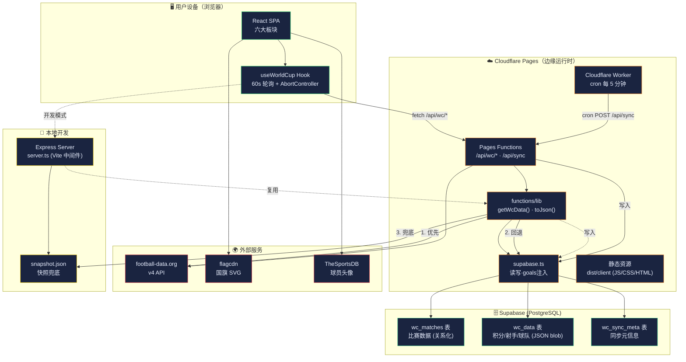
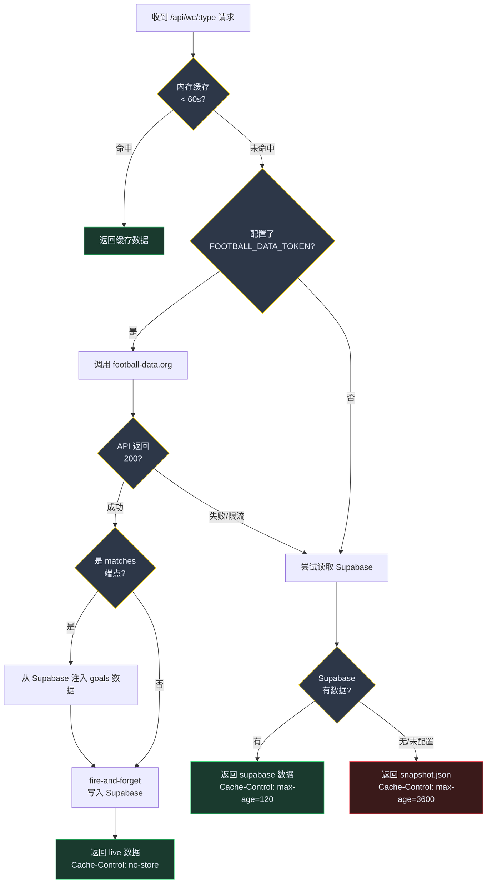
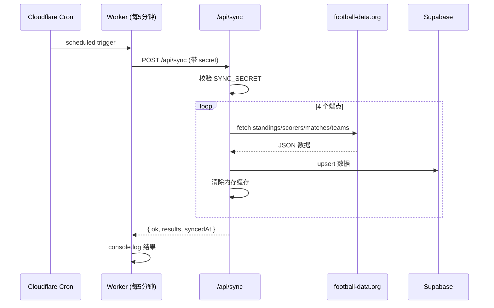
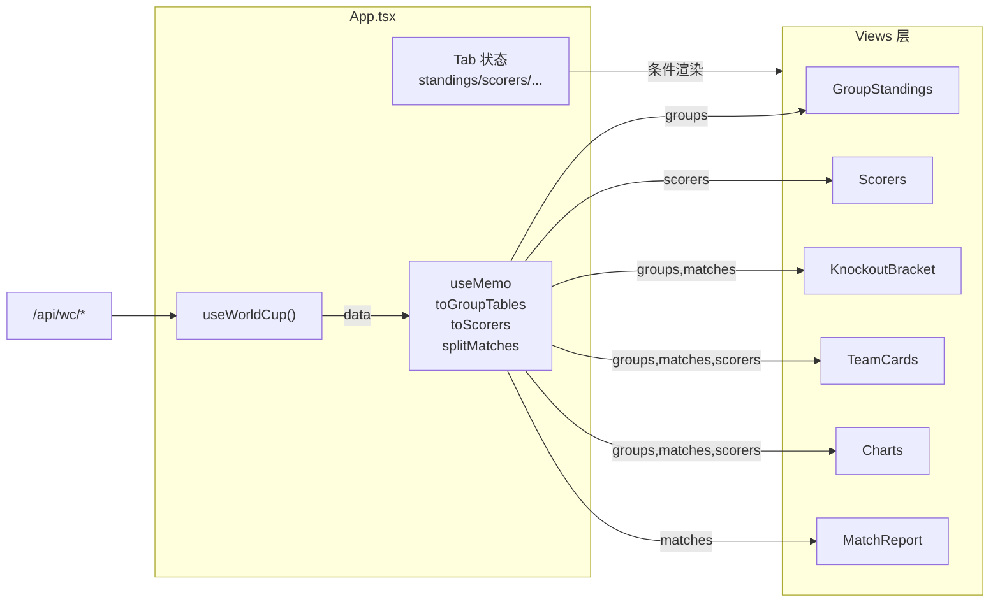
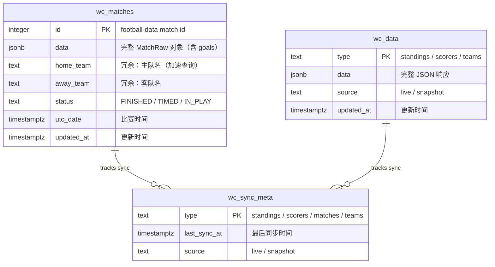
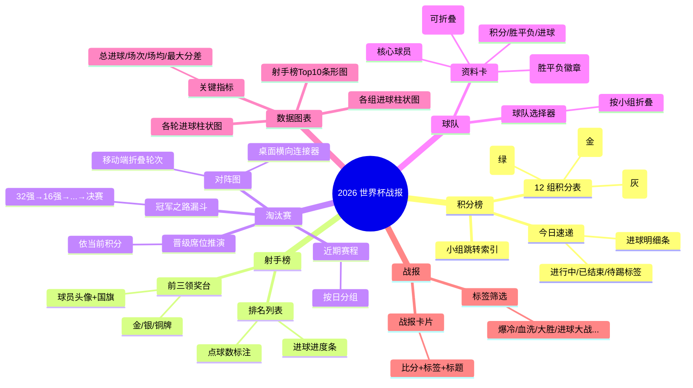
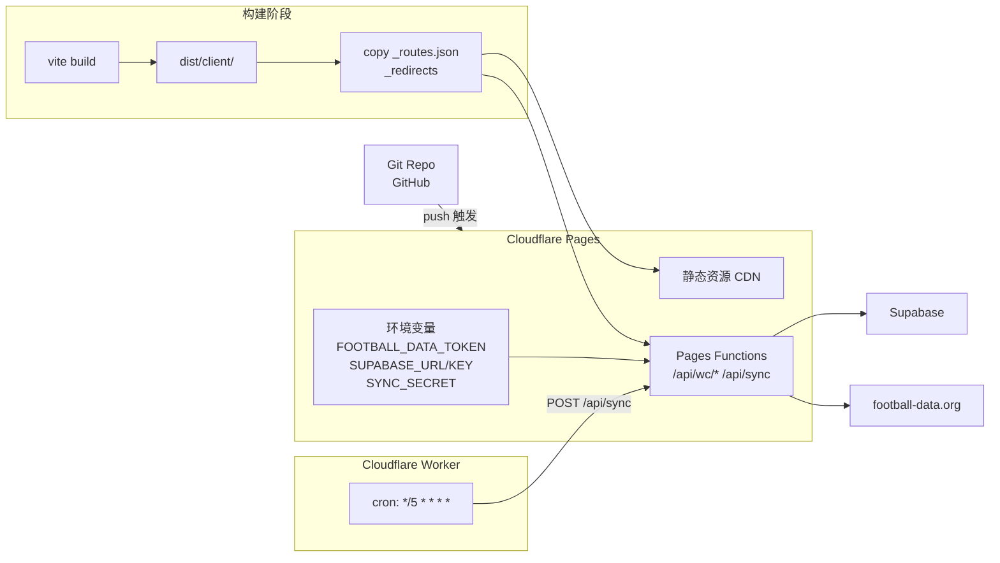

# 2026 世界杯实时战报 — 系统说明书

> **版本**：v1.0 · **更新日期**：2026-06-24 · **状态**：生产可用

---

## 目录

1. [系统概述](#1-系统概述)
2. [系统架构图](#2-系统架构图)
3. [技术栈](#3-技术栈)
4. [模块详解](#4-模块详解)
5. [数据流与运行机制](#5-数据流与运行机制)
6. [数据库设计](#6-数据库设计)
7. [API 接口文档](#7-api-接口文档)
8. [前端页面说明](#8-前端页面说明)
9. [部署架构](#9-部署架构)
10. [环境变量配置](#10-环境变量配置)
11. [开发与运维](#11-开发与运维)
12. [已知限制与后续规划](#12-已知限制与后续规划)

---

## 1. 系统概述

### 1.1 项目简介

**2026 世界杯实时战报** 是一个覆盖 2026 FIFA 世界杯（美/加/墨，48 队赛制）的实时赛事数据应用。提供小组赛积分榜、射手榜、淘汰赛对阵、球队资料卡、数据图表、自动战报六大功能板块。

### 1.2 核心特性

| 特性 | 说明 |
|---|---|
| **三级数据回退** | Live API → Supabase 数据库 → 本地快照，保证任何环境可用 |
| **无 Key 可运行** | 内置真实赛果快照，零配置即可启动 |
| **配 Key 即实时** | 分钟级刷新（60s 轮询），适配 football-data.org 免费档限流 |
| **响应式设计** | 桌面端 Tab 导航 + 移动端底部导航，适配 iOS safe-area |
| **自动战报生成** | 基于比分模板化生成中文战报，支持标签筛选，无需 LLM |
| **定时同步** | Cloudflare Worker 每 5 分钟 cron 触发，将 live 数据写入 Supabase |

### 1.3 数据源

- **主数据源**：[football-data.org](https://www.football-data.org/) v4 API（竞赛代码 `WC`）
- **国旗**：[flagcdn](https://flagcdn.com/) SVG 矢量国旗
- **球员头像**：[TheSportsDB](https://www.thesportsdb.com/) 真实照片 + [ui-avatars](https://ui-avatars.com/) 文字头像兜底
- **快照数据**：截至 2026-06-23 的真实赛况（交叉验证自 NBC/ESPN），射手榜为示例数据

---

## 2. 系统架构图

### 2.1 整体架构



### 2.2 数据回退决策流程



### 2.3 定时同步流程



---

## 3. 技术栈

### 3.1 前端

| 技术 | 版本 | 用途 |
|---|---|---|
| React | 19.0 | UI 框架 |
| Vite | 6.2 | 构建工具 + 开发服务器 |
| TypeScript | 5.8 | 类型安全 |
| Tailwind CSS | 4.1 | 原子化 CSS（@theme 自定义主题） |
| recharts | 3.8 | 数据图表（柱状图/条形图） |
| motion | 12.23 | 动画（Framer Motion 新包名） |
| lucide-react | 0.546 | 图标库 |
| clsx + tailwind-merge | — | className 合并工具 |

### 3.2 后端

| 技术 | 版本 | 用途 |
|---|---|---|
| Cloudflare Pages Functions | — | 边缘 Serverless（生产） |
| Express | 4.21 | 本地开发服务器 |
| @supabase/supabase-js | 2.108 | Supabase 客户端 |
| Cloudflare Workers | — | 定时同步 cron 任务 |

### 3.3 基础设施

| 服务 | 用途 |
|---|---|
| Cloudflare Pages | 静态托管 + Pages Functions（边缘运行时） |
| Cloudflare Worker | cron 定时同步（每 5 分钟） |
| Supabase (PostgreSQL) | 数据持久化层 |
| football-data.org | 实时赛况数据源 |

---

## 4. 模块详解

### 4.1 项目目录结构

```
worldcup-report/
├── src/                          # 前端源码
│   ├── api/
│   │   ├── client.ts             # useWorldCup Hook（数据拉取+轮询）
│   │   └── teams.ts              # useTeams Hook（球队阵容）
│   ├── components/
│   │   └── ui.tsx                # 通用 UI 组件（Card/Flag/Tag/Loader 等）
│   ├── lib/
│   │   ├── transform.ts          # 数据转换（积分榜/射手榜/比赛拆分）
│   │   ├── report.ts             # 战报生成（模板化）
│   │   ├── teams.ts              # 球队/球员/教练中文名映射
│   │   ├── format.ts             # 日期时间格式化
│   │   ├── player-names.generated.ts  # 自动生成的球员名映射
│   │   └── transform.test.ts     # 单元测试
│   ├── types/
│   │   └── worldcup.ts           # 全局类型定义
│   ├── views/                    # 六大页面组件
│   │   ├── GroupStandings.tsx    # 积分榜
│   │   ├── Scorers.tsx           # 射手榜
│   │   ├── KnockoutBracket.tsx   # 淘汰赛（赛程+冠军之路+晋级推演）
│   │   ├── KnockoutDraw.tsx      # 淘汰赛对阵图（桌面横向+移动折叠）
│   │   ├── TeamCards.tsx         # 球队资料卡
│   │   ├── Charts.tsx            # 数据图表
│   │   └── MatchReport.tsx       # 战报列表
│   ├── App.tsx                   # 应用外壳（Tab 导航+布局）
│   ├── main.tsx                  # 入口
│   └── index.css                 # 全局样式 + Tailwind 主题
├── functions/                    # Cloudflare Pages Functions
│   ├── api/
│   │   ├── wc/[type].ts          # 数据查询端点（standings/scorers/matches/teams）
│   │   └── sync.ts               # 同步端点（POST 写入 / GET 查询元信息）
│   └── lib/
│       ├── snapshot.ts           # 三级回退核心逻辑（getWcData/toJson）
│       └── supabase.ts           # Supabase 读写 + goals 注入
├── worker/                       # Cloudflare Worker（定时同步）
│   ├── index.ts                  # cron handler
│   └── wrangler.jsonc            # Worker 配置
├── data/                         # 数据层
│   ├── snapshot.json             # 兜底快照（真实赛果）
│   ├── goals.json                # 进球明细数据
│   ├── build-snapshot.mjs        # 快照生成脚本
│   ├── build-player-names.mjs    # 球员名映射生成脚本
│   └── seed-supabase.mjs         # Supabase 种子脚本
├── supabase/
│   └── migrations/001_init.sql   # 数据库 Schema
├── public/                       # Cloudflare Pages 配置
│   ├── _routes.json              # Functions 路由规则
│   └── _redirects                # SPA fallback
├── server.ts                     # Express 开发服务器
├── vite.config.ts                # Vite 构建配置
├── tsconfig.json                 # TypeScript 配置
├── wrangler.jsonc                # Pages 配置
└── package.json
```

### 4.2 核心模块说明

#### `functions/lib/snapshot.ts` — 三级回退核心

系统最关键的模块，统一被 Pages Functions 和 Express 开发服务器复用：

```
getWcData(type, token?, sbConfig?)
  ├─ 1. 有 token → fetch football-data.org → 成功则 fire-and-forget 写 Supabase
  ├─ 2. live 失败 → 读 Supabase → 有数据则返回
  └─ 3. 都不可用 → 返回 snapshot.json 快照
```

- **goals 注入**：football-data.org 免费档不提供进球明细，`injectSupabaseGoals()` 从 Supabase 补充已存储的 goals 数据（双策略：match ID 匹配 → 球队名对匹配）
- **缓存策略**：`toJson()` 按数据源设置不同 `Cache-Control`（live: no-store / supabase: 120s / snapshot: 3600s）

#### `src/lib/transform.ts` — 数据转换层

纯函数模块，将 API 原始数据转换为视图模型：

| 函数 | 输入 | 输出 | 用途 |
|---|---|---|---|
| `toGroupTables()` | StandingsResponse | GroupTable[] | 12 组积分榜，按 A-L 排序 |
| `bestThirdIds()` | GroupTable[] | Set\<number\> | 48 队赛制最佳第三名 8 席 |
| `qualifyState()` | StandingRow + Set | QualifyState | 晋级状态（直接/最佳第三/待定/淘汰） |
| `toScorers()` | ScorersResponse | ScorerRaw[] | 射手榜排序（进球→助攻→点球少优先） |
| `splitMatches()` | MatchesResponse | SplitMatches | 比赛按状态拆分（已赛/待赛/进行中） |
| `todayMatches()` | SplitMatches | { matches, fallback } | 今日比赛（北京时间），无则回退最近比赛日 |
| `goalsByGroup()` | GroupTable[] | { group, goals }[] | 各组进球统计（图表用） |
| `goalsByMatchday()` | MatchRaw[] | { matchday, goals, matches }[] | 各轮进球统计（图表用） |

#### `src/lib/report.ts` — 战报生成引擎

基于比分规则模板化生成中文战报标题和标签，无需 LLM：

| 比分特征 | 标签 | 标题模板 |
|---|---|---|
| 平局 0-0 | 闷平 | `{h} 与 {a} 互交白卷，闷平收场` |
| 平局有进球 | 握手言和 | `{h} {s}-{s} 战平 {a}，握手言和` |
| 分差 ≥ 4 | 血洗 | `{赢家} {ws}-{ls} 血洗 {输家}` |
| 分差 = 3 | 大胜 | `{赢家} {ws}-{ls} 大胜 {输家}` |
| 分差 = 2 | — | `{赢家} {ws}-{ls} 击退 {输家}` |
| 分差 = 1 | 一球小胜 | `{赢家} {ws}-{ls} 险胜 {输家}` |
| 弱队赢强队 | 爆冷 | （unshift 到标签首位） |
| 总进球 ≥ 5 | 进球大战 | （追加标签） |

#### `src/lib/teams.ts` — 本地化映射

- **球队映射**：英文名 → {中文名, flagcdn 国旗代码}，含别名兼容（如 `South Korea` / `Korea Republic`）
- **归一化**：NFD 分解 → 小写 → 去重音符号，兼容各种数据源命名差异
- **球员映射**：player ID → 中文名（手动维护 + 自动生成两套）
- **教练映射**：英文名关键词匹配 → 中文名
- **球员头像**：优先 TheSportsDB 真实照片，兜底 ui-avatars 文字头像（按队名 hash 取色）

#### `src/api/client.ts` — 数据拉取 Hook

```typescript
useWorldCup(intervalMs = 60_000)
  → { data, loading, error, source, updatedAt, reload }
```

- 并行拉取 3 个端点（standings / scorers / matches）
- 60s 自动轮询，仅页面可见时触发
- `AbortController` 取消未完成请求（组件卸载/重新加载时）
- `inFlight` ref 防重入

---

## 5. 数据流与运行机制

### 5.1 前端数据流



### 5.2 请求缓存机制

| 层级 | 位置 | TTL | 说明 |
|---|---|---|---|
| L1 浏览器 | `cache: "no-store"` | — | 前端每次带 `_t=timestamp` 破缓存 |
| L2 服务端内存 | `cache Map` | 60s | Express 开发模式，避免频繁打外部 API |
| L3 HTTP 缓存 | `Cache-Control` | 按数据源 | live: no-store / supabase: 120s / snapshot: 3600s |
| L4 Supabase | PostgreSQL | 持久 | live 数据 fire-and-forget 写入，作为回退源 |

### 5.3 Goals 数据合并策略

football-data.org 免费档不提供进球明细，系统通过 Supabase 补充：

```mermaid
flowchart TD
    LIVE["live API 返回<br/>matches（无 goals）"]
    NEED["筛选 FINISHED 且无 goals<br/>的比赛"]
    S1["策略1: 按 match ID 匹配<br/>查 wc_matches 表"]
    S1_OK{"ID 匹配?"}
    S2["策略2: 按球队名对匹配<br/>查所有 FINISHED 比赛"}
    S2_OK{"名对匹配?"}
    INJECT["注入 goals 到 match.goals"]
    SKIP["跳过（无 goals 数据）"]

    LIVE --> NEED --> S1 --> S1_OK
    S1_OK -->|"成功"| INJECT
    S1_OK -->|"失败"| S2 --> S2_OK
    S2_OK -->|"成功"| INJECT
    S2_OK -->|"失败"| SKIP
```

球队名归一化处理 live API 与快照的命名差异（如 `Côte d'Ivoire` → `ivorycoast`、`Türkiye` → `turkiye`）。

---

## 6. 数据库设计

### 6.1 ER 图



### 6.2 存储策略

采用**混合策略**：

| 表 | 存储方式 | 原因 |
|---|---|---|
| `wc_matches` | **关系化** | 需要按 status 查询、按球队名匹配 goals、增量 upsert |
| `wc_data` | **JSON blob** | standings/scorers/teams 整体读写，无需关系化 |
| `wc_sync_meta` | **关系化** | 记录各类型最后同步时间和数据源 |

### 6.3 安全

- **RLS 已启用但无策略**：所有访问走 service_role key（绕过 RLS），前端不直连 Supabase
- **service_role key 仅服务端使用**：通过环境变量注入，不暴露给前端

---

## 7. API 接口文档

### 7.1 数据查询接口

#### `GET /api/wc/:type`

获取世界杯数据，支持三级回退。

| 参数 | 值 | 说明 |
|---|---|---|
| `:type` | `standings` | 12 组积分榜 |
| | `scorers` | 射手榜（Top 30） |
| | `matches` | 全部比赛（含 goals 明细） |
| | `teams` | 48 队阵容（教练+球员） |

**响应头**：
- `X-Data-Source`: `live` / `supabase` / `snapshot`
- `Cache-Control`: 按数据源动态设置

**响应体**（附加字段）：
```json
{
  "standings": [...],
  "_source": "live",
  "_asOf": "2026-06-24T07:35:00.000Z"
}
```

### 7.2 同步接口

#### `POST /api/sync`

从 football-data.org 拉取全量数据写入 Supabase。

**鉴权**：`SYNC_SECRET` 环境变量（query `?secret=` 或 header `X-Sync-Secret`）

**响应**：
```json
{
  "ok": true,
  "results": {
    "matches": "72 matches synced",
    "standings": "12 synced",
    "scorers": "18 synced",
    "teams": "48 synced"
  },
  "syncedAt": "2026-06-24T07:35:00.000Z"
}
```

#### `GET /api/sync`

查询同步元信息（同样需要鉴权）。

**响应**：
```json
{
  "syncMeta": [
    { "type": "matches", "last_sync_at": "...", "source": "live" },
    ...
  ]
}
```

---

## 8. 前端页面说明

### 8.1 页面总览



### 8.2 响应式布局

| 断点 | 导航方式 | 布局 |
|---|---|---|
| `< 768px` (移动) | 底部 Tab 栏（safe-area 适配） | 单列 |
| `≥ 768px` (桌面) | 顶部 Tab 栏（sticky） | 2-4 列网格 |

使用 `h-[100dvh]` 动态视口高度，避免 iOS 工具栏导致的滚动空白。

---

## 9. 部署架构

### 9.1 生产环境（Cloudflare Pages）



### 9.2 部署方式

**方式一：CLI 手动部署**
```bash
npm run deploy
# = vite build + wrangler pages deploy dist/client
```

**方式二：Git 集成自动部署**
- 连接 GitHub 仓库到 Cloudflare Pages
- push 到 main 分支自动触发构建部署
- 构建命令：`npm run build`
- 输出目录：`dist/client`

### 9.3 路由配置

**`public/_routes.json`** — 指定哪些路径走 Functions：
```json
{ "version": 1, "include": ["/api/wc/*", "/api/sync"], "exclude": [] }
```

**`public/_redirects`** — SPA fallback：
```
/*    /index.html   200
```

---

## 10. 环境变量配置

### 10.1 变量清单

| 变量名 | 必需 | 用途 | 配置位置 |
|---|---|---|---|
| `FOOTBALL_DATA_TOKEN` | 否* | football-data.org API token | Cloudflare Pages → Settings → Env Vars |
| `SUPABASE_URL` | 否** | Supabase 项目 URL | 同上 |
| `SUPABASE_SERVICE_ROLE_KEY` | 否** | Supabase service_role 密钥 | 同上 |
| `SYNC_SECRET` | 推荐 | /api/sync 鉴权密钥 | 同上 + Worker |
| `PORT` | 否 | 开发服务器端口（默认 5273） | 本地 .env |
| `NODE_ENV` | 否 | production 时启用静态文件服务 | 自动 |

> *不配置则使用快照数据，应用仍可运行
> **不配置则跳过 Supabase 回退层

### 10.2 本地开发

```bash
# .env 文件
FOOTBALL_DATA_TOKEN=你的token
SUPABASE_URL=https://xxx.supabase.co
SUPABASE_SERVICE_ROLE_KEY=eyJxxx
SYNC_SECRET=你的密钥
```

### 10.3 Worker 环境变量

| 变量名 | 用途 |
|---|---|
| `SYNC_URL` | Pages 的 /api/sync 完整 URL |
| `SYNC_SECRET` | 鉴权密钥（与 Pages 一致） |

---

## 11. 开发与运维

### 11.1 本地开发

```bash
npm install          # 安装依赖
npm run dev          # 启动开发服务器 http://localhost:5273
npm test             # 运行单元测试
npm run lint         # TypeScript 类型检查
npm run snapshot     # 重新生成快照数据
npm run build        # 构建前端
```

### 11.2 Supabase 初始化

```bash
# 1. 在 Supabase Dashboard 执行 supabase/migrations/001_init.sql
# 2. 种子数据
SUPABASE_URL=xxx SUPABASE_SERVICE_ROLE_KEY=xxx node data/seed-supabase.mjs
```

### 11.3 监控与排障

| 场景 | 排查方式 |
|---|---|
| 数据不更新 | `GET /api/sync?secret=xxx` 查看 last_sync_at |
| 限流 (429) | 检查 football-data.org 免费档配额（10次/分钟） |
| 数据源异常 | 查看响应头 `X-Data-Source` 确认当前回退层级 |
| Worker 未执行 | Cloudflare Dashboard → Workers → Logs |
| goals 缺失 | 检查 Supabase wc_matches 表是否有 goals 字段 |

### 11.4 快照更新流程

```bash
# 1. 编辑 data/build-snapshot.mjs 中的赛果数据
# 2. 重新生成
npm run snapshot
# 3. 种子到 Supabase
node data/seed-supabase.mjs
# 4. 重新部署
npm run deploy
```

---

## 12. 已知限制与后续规划

### 12.1 当前限制

| 限制 | 说明 |
|---|---|
| 免费档无实时比分 | football-data.org 免费档不提供 live 比分，仅 FINISHED 后才有结果 |
| 免费档无 goals 明细 | 进球明细需手动维护 goals.json 并种子到 Supabase |
| 射手榜为示例数据 | 快照模式下射手榜非真实数据 |
| 无 SSR/SSG | 纯 SPA，首屏需加载 JS 后渲染 |
| 最佳第三名排序简化 | 未含公平竞赛分等 FIFA 完整规则 |
| 包体积偏大 | 构建产物 ~800KB（recharts + motion 较重） |

### 12.2 后续规划

| 方向 | 计划 |
|---|---|
| 代码分割 | 按 Tab 路由懒加载，减小首屏体积 |
| SSR 支持 | 考虑 Cloudflare Pages + React SSR 提升首屏 |
| 实时比分 | 接入 WebSocket 推送（需付费数据源） |
| PWA | 添加 Service Worker 支持离线访问 |
| 国际化 | 抽离 i18n，支持中英文切换 |
| 推送通知 | 关注球队进球/开赛提醒 |

---

## 附录

### A. 关键文件索引

| 文件 | 职责 |
|---|---|
| `functions/lib/snapshot.ts` | 三级回退核心逻辑 |
| `functions/lib/supabase.ts` | Supabase 读写 + goals 注入 |
| `src/lib/transform.ts` | 数据转换纯函数 |
| `src/lib/report.ts` | 战报模板引擎 |
| `src/lib/teams.ts` | 本地化映射表 |
| `src/api/client.ts` | 数据拉取 Hook |
| `data/build-snapshot.mjs` | 快照生成脚本 |
| `supabase/migrations/001_init.sql` | 数据库 Schema |

### B. 48 队赛制说明

2026 世界杯为首次 48 队赛制：
- **小组赛**：12 组（A-L），每组 4 队，单循环
- **晋级规则**：每组前 2 名（24 队）+ 8 个成绩最好的第三名（8 队）= 32 队进入淘汰赛
- **淘汰赛**：32强 → 16强 → 1/4决赛 → 半决赛 → 决赛（共 5 轮）
- **最佳第三名排序**：积分 → 净胜球 → 进球数（简化版）

---

*本说明书由代码库自动分析生成，最后更新于 2026-06-24。*
